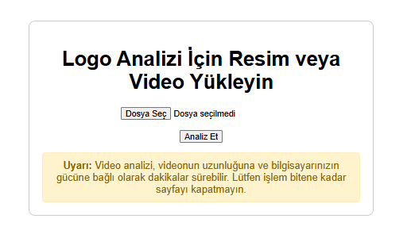

# YOLOv8 ile Görüntü ve Videolarda Logo Tespiti

Bu proje, kullanıcının yüklediği resim veya videolardaki marka logolarını tespit etmek için YOLOv8 modelini kullanan bir web uygulamasıdır. Tespit edilen logoların etrafına kutular çizer, marka bazında sayım yapar ve sonuçları kullanıcı dostu bir arayüzde sunar.



## 🚀 Temel Özellikler

- **Resim ve Video Desteği:** Hem statik resimler hem de videolar analiz edilebilir.
- **Çoklu Logo Tespiti:** Tek bir resim veya video karesi içinde birden fazla logoyu aynı anda tespit eder.
- **Nesne Takibi (Video):** Videolardaki logoların anlık kaybolup belirme (titreme) sorununu çözmek için nesne takibi algoritması kullanır.
- **Detaylı Sonuç Raporlama:**
  - **Resimler için:** Tespit edilen logoların ve güven skorlarının listesi.
  - **Videolar için:** Videoda görülen toplam benzersiz logo sayısı, her markanın kaç kez tespit edildiği ve indirilmeye hazır, üzerinde kutular çizilmiş yeni bir video dosyası.
- **Kullanıcı Dostu Arayüz:** Yükleme işlemi sırasında (videolar için) bekleme animasyonu gösterir.

## 🛠️ Kullanılan Teknolojiler

- **Backend:** Python, Flask
- **Model:** Ultralytics YOLOv8
- **Veri Seti:** [Roboflow Universe - Logo Brand Detection](https://universe.roboflow.com/aitesting-9dz7l/logo-brand)
- **Kütüphaneler:** OpenCV-Python, Pillow, NumPy
- **Frontend:** HTML, CSS, JavaScript

## 🔧 Kurulum ve Çalıştırma

Projeyi yerel makinenizde çalıştırmak için aşağıdaki adımları izleyin.

### 1. Projeyi Klonlama (veya İndirme)

```bash
git clone [https://github.com/KULLANICI_ADINIZ/PROJE_ADI.git](https://github.com/KULLANICI_ADINIZ/PROJE_ADI.git)
cd PROJE_ADI
```

### 2. Sanal Ortam Oluşturma ve Aktive Etme

Python 3.8.3 veya üstü bir versiyon kullanmanız tavsiye edilir.

```bash
# Sanal ortamı oluştur
python -m venv venv_yolo

# Windows için aktive etme
.\venv_yolo\Scripts\activate

# macOS/Linux için aktive etme
# source venv_yolo/bin/activate
```

### 3. Bağımlılıkları Yükleme

Proje için gerekli tüm kütüphaneler `requirements.txt` dosyasında listelenmiştir.

```bash
pip install -r requirements.txt
```

### 4. Uygulamayı Çalıştırma

```bash
python app.py
```

Uygulama başladığında, terminalde `* Running on http://127.0.0.1:1071/` gibi bir çıktı göreceksiniz. Tarayıcınızı açıp bu adrese gidin.

## 📂 Proje Yapısı

```
.
├── best.pt                 # Eğitilmiş YOLOv8 modeli
├── app.py                  # Ana Flask uygulaması
├── helpers.py              # Görüntü/Video işleme fonksiyonları
├── train_model.py          # Model eğitim script'i
├── requirements.txt        # Gerekli Python kütüphaneleri
├── README.md               # Bu dosya
├── templates/
│   ├── index.html          # Ana yükleme sayfası
│   ├── result.html         # Resim sonuç sayfası
│   └── video_result.html   # Video sonuç sayfası
└── uploads/                # Kullanıcı tarafından yüklenen ve işlenen dosyaların geçici olarak tutulduğu yer
└── runs/                   
```

## 💡 Model Summary

Model summary (fused): 72 layers, 3,417,080 parameters, 0 gradients, 10.0 GFLOPs
val: Fast image access ✅ (ping: 0.0±0.0 ms, read: 632.0±339.0 MB/s, size: 27.1 KB)
val: Scanning /dataset/Logo-Detector-2/test/labels... 565 images, 0 backgrounds, 0 corrupt: 100% ━━━━━━━━━━━━ 565/565 1.5Kit/s 0.4s
val: New cache created: /dataset/Logo-Detector-2/test/labels.cache
                 Class     Images  Instances      Box(P          R      mAP50  mAP50-95): 100% ━━━━━━━━━━━━ 36/36 7.8it/s 4.6s
                   all        565        976      0.704      0.506      0.562      0.364
                adidas         12         13      0.762      0.615      0.631      0.431
               adidas1          4          5      0.337        0.4      0.224      0.139
           adidas_text          2          2          1          0      0.373      0.131
               airness          1          1          1          0      0.199     0.0398
                  aldi          7         10      0.901        0.8      0.799      0.659
             aldi_text          1          1      0.709          1      0.995      0.796
                allett          1          2          1          0          0          0
               allianz          1          1      0.383          1      0.995      0.796
          allianz_text          1          1      0.413          1      0.995      0.497
              aluratek          2          2          1          0     0.0568     0.0284
         aluratek_text          1          1      0.753          1      0.995      0.398
                amazon          3          3      0.596      0.333      0.367      0.109
                   anz          3          5      0.748          1      0.995       0.63
                   apc          1          1      0.442          1      0.995      0.497
                 apple         13         15      0.791       0.76       0.83      0.504
          aquapac_text          1          1          1          0          0          0
              armitron          3          3      0.654      0.641      0.696      0.358
                  asus          1          1          1          0          0          0
              barclays          2          2      0.607        0.5      0.538      0.377
                  basf          1          1          0          0      0.249     0.0791
                 becks          5          6      0.867      0.667      0.697      0.518
                   bem          2          2      0.583          1      0.828      0.132
                   bik          2          3      0.363          1       0.83      0.649
            blackmores          1          1      0.518          1      0.995      0.697
                   bmw         19         23       0.84      0.826      0.826      0.555
                boeing          1          1      0.714          1      0.995      0.398
                 bosch          2          3      0.847      0.667      0.668      0.435
            bosch_text          3          4       0.64          1      0.849      0.547
           bridgestone          2          2          1          0          0          0
      bridgestone_text          2          2      0.745        0.5      0.501      0.301
             budweiser          1          1      0.248          1      0.249      0.174
        budweiser_text          3          8      0.662      0.625      0.534      0.282
               bulgari          2          2          1          0          0          0
            burgerking          3         13      0.869      0.923      0.926      0.594
       burgerking_text          2          2      0.371          1      0.995      0.497
           calvinklein          1          1          1          0          0          0
                 canon          4          4      0.412       0.75      0.856      0.464
              carglass          2          2      0.743          1      0.995      0.796
             carlsberg          8         10      0.657        0.8      0.755       0.47
               cartier          4          6      0.325      0.333      0.563      0.299
           caterpillar          2          2      0.524          1      0.828       0.58
                chanel          2          2      0.425          1      0.995      0.746
           chanel_text          4         21      0.647      0.429      0.539      0.208
             chevrolet          1          1          0          0      0.332     0.0995
               chevron          1          1          1          0      0.995      0.597
             chickfila          1          1          1          0          0          0
                chimay          8         12      0.743      0.833      0.771      0.575
                 cisco          1          1      0.667          1      0.995      0.697
              cocacola         19         35      0.811      0.686      0.745      0.455
                  coke          1          1          1          0     0.0231     0.0162
               colgate          3          5       0.56          1      0.928       0.54
         comedycentral          1          1          1          0          0          0
              converse          1          1      0.605          1      0.995      0.796
                corona         11         18       0.75      0.889      0.885      0.686
           corona_text          1          1          0          0     0.0995     0.0398
                costco          2          2      0.734          1      0.995      0.597
         cpa_australia          2          2      0.403          1      0.995      0.597
           cvspharmacy          2          4       0.55          1      0.849      0.742
                 dexia          4          6      0.608      0.667      0.789      0.474
                   dhl          7         15      0.887      0.867      0.845      0.528
          dunkindonuts          1          1          1          0          0          0
                  ebay          1          1          1          0      0.124     0.0871
              erdinger          7         12       0.61       0.75      0.669      0.484
                  esso          3          3      0.618          1      0.995      0.895
              evernote          1          1      0.537          1      0.995      0.796
                 fedex          9         16      0.804          1      0.991        0.7
               ferrari         12         12      0.738      0.917      0.912      0.638
          fly_emirates          1          1      0.627          1      0.995      0.796
                  ford          8          9      0.769      0.742      0.796      0.509
               fosters          4          6      0.771      0.571      0.756      0.451
              fritolay          1          1      0.313      0.626      0.497      0.448
              gillette          3         14      0.786      0.526      0.709      0.403
                google          7          8      0.792      0.875      0.946      0.656
                 gucci          3          3      0.296      0.333      0.361      0.141
              guinness          4          5      0.835          1      0.995      0.622
                 hanes          1          1      0.667          1      0.995      0.895
                  head          2          2          1          0          0          0
             head_text          1          1          1          0      0.995      0.796
              heineken          8         13       0.37      0.308      0.404      0.342
         heineken_text         19         57      0.662      0.579      0.612      0.384
              hersheys          2          5      0.524        0.2      0.507      0.305
                    hh          2          2          0          0      0.398     0.0503
               hisense          1          2          0          0      0.108     0.0461
                 honda          2          2      0.433        0.5      0.255      0.176
            honda_text          2          2          1          0          0          0
                    hp          4          4      0.696          1      0.995      0.759
                  hsbc          3          3      0.627      0.333      0.472      0.364
             hsbc_text          2          3      0.616      0.333       0.36      0.318
                huawei          4          7      0.879          1      0.995      0.619
           huawei_text          4          5      0.471      0.718       0.64       0.47
               hyundai          4         10      0.547        0.3      0.305      0.196
          hyundai_text          1          3          1          0          0          0
                   ibm          2          3      0.726      0.667      0.727      0.625
                 intel          2          5      0.567        0.2      0.228      0.178
      internetexplorer          1          1          0          0          0          0
           jacobscreek          6          7      0.609      0.286      0.453      0.343
                 jello          1          2          1          0          0          0
          johnnywalker          1          1      0.992          1      0.995      0.697
              jurlique          2          6      0.737      0.667      0.699      0.485
              kelloggs          3         10          1      0.982      0.995      0.695
                   kia          8         18      0.623      0.444       0.45      0.306
                 kodak          2          2          1          0      0.503      0.302
                 kraft          3          7      0.954      0.714       0.77       0.55
               lacoste          4          6      0.666      0.665      0.583      0.324
          lacoste_text          1          1          1          0          0          0
                  lays          1          2      0.697          1      0.995      0.746
                  lego          1          1      0.569          1      0.995      0.697
                 levis          2          2          1          0      0.142      0.071
                 lexus          1          1          1          0      0.995     0.0995
                    lg          1          1          1          0      0.166     0.0498
     londonunderground          1          1          1          0          0          0
                loreal          4          4      0.617        0.5      0.451       0.35
         marlboro_text          1          2      0.925        0.5      0.662       0.29
              maserati          1          1          1          0      0.249      0.124
          maxwellhouse          1          1          1          0          0          0
                maxxis          2          2          0          0    0.00428    0.00343
             mcdonalds          3          6      0.855      0.667      0.948      0.597
        mcdonalds_text          1          2      0.511        0.5      0.745       0.41
          mercedesbenz          3          5      0.554          1      0.995      0.441
              michelin          1          1       0.69          1      0.995      0.298
                 milka          7         19      0.787      0.895      0.927      0.684
                  mini          1          1      0.652          1      0.995      0.497
            mitsubishi          1          1          0          0     0.0321      0.016
                    mk          2          2      0.712          1      0.995      0.598
                 mobil          1          1      0.745          1      0.995      0.796
              motorola          1          1          1          0          0          0
               nescafe          3          7      0.714      0.857      0.727       0.54
                  nike         10         13      0.559      0.385      0.417      0.195
                nissan          1          2      0.405        0.5      0.695      0.288
                 nivea          4         14      0.211     0.0714     0.0754     0.0379
                nvidia          5          6      0.795          1      0.995      0.649
                 optus          1          1      0.374          1      0.995      0.796
                oracle          1          1          1          0      0.995      0.697
              paulaner          7         19      0.884      0.579      0.786      0.475
                 pepsi         14         15      0.797      0.867      0.896       0.57
           pepsi_text1          1          1          1          0          0          0
          philadelphia          1          1      0.915          1      0.995      0.298
              pizzahut          2          3      0.589      0.667      0.753       0.53
          pizzahut_hut          2          2      0.702          1      0.995      0.647
           playstation          1          1          1          0     0.0585      0.041
               porsche          1          1          1          0          0          0
                 prada          2          2      0.608        0.5      0.497      0.298
                  puma          4          7      0.457      0.286      0.309      0.161
             recycling          1          1      0.482          1      0.995      0.597
               redbull          4          6      0.675        0.5      0.566      0.271
          redbull_text          6          8      0.811      0.375      0.504      0.309
                reebok          2          2          1          0      0.127     0.0889
           reebok_text          1          1          1          0      0.497      0.199
               renault          1          1          1          0          0          0
           rittersport          6         20      0.837        0.7      0.825       0.56
                 rolex         10         10      0.757      0.626      0.791      0.446
            rolex_text          2          7      0.379      0.286      0.171     0.0729
             santander          2          4          0          0     0.0662     0.0529
        santander_text          4          4      0.545       0.25      0.504      0.224
               schwinn          1          1          1          0          0          0
                select          1          1          0          0      0.332      0.199
                 shell         10         15      0.826        0.8      0.878      0.696
            shell_text          1          2       0.94          1      0.995      0.846
           shell_text1          2          8          1          0     0.0776     0.0351
                singha          3          3      0.815          1      0.995      0.895
              skechers          5          5          1          0      0.166      0.114
                  sony          1          1          1          0          0          0
            soundcloud          1          1          1          0          0          0
             spiderman          1          1          1          0          0          0
        standard_liege          1          1          1          0      0.497      0.199
             starbucks         16         18      0.703      0.944      0.943      0.673
          stellaartois          7         14      0.851      0.714      0.723      0.557
                subaru          1          1          1          0     0.0765     0.0536
                subway          1          1      0.651          1      0.995      0.796
               supreme          1          1          1          0      0.199     0.0893
              t-mobile          3          8      0.737        0.5      0.511      0.417
              tacobell          2          2          1          0          0          0
                target          2          3      0.385      0.667      0.626      0.369
           teslamotors          2          2          1          0     0.0532     0.0319
                texaco          6         14       0.79      0.643      0.771      0.478
                tissot          1          1          1          0          0          0
                   tnt          1          1        0.6          1      0.995      0.697
                toyota          8          9      0.585      0.667       0.67      0.493
           toyota_text          3          3      0.345      0.333      0.413      0.289
              tsingtao          4          4      0.536       0.75       0.72      0.604
                 umbro          2          3          1          0     0.0425     0.0198
                uniqlo          2          3      0.732      0.928      0.913      0.581
               uniqlo1          2          3      0.444          1      0.995      0.763
         unitednations          2          2      0.361      0.361      0.359      0.264
                   ups          3          4      0.691          1      0.796      0.699
                  vaio          3          3          0          0      0.338      0.203
                  visa          4          5      0.704        0.8       0.84      0.458
              vodafone          1          2          1          0     0.0313     0.0219
            volkswagen          8         13      0.765      0.692      0.727      0.538
               walmart          1          1      0.638          1      0.995      0.796
          walmart_text          1          1          1          0          0          0
            wellsfargo          1          2      0.767        0.5      0.695      0.497
       wellsfargo_text          1          1      0.614          1      0.995      0.895
           williamhill          1          2      0.498        0.5      0.499      0.226
             wordpress          1          2          1          0      0.166      0.108
                 yahoo          1          1          1          0          0          0
            yonex_text          2          3      0.822      0.333      0.336      0.101
                  zara          2          4      0.468       0.75      0.629      0.506
Speed: 0.4ms preprocess, 3.2ms inference, 0.0ms loss, 1.3ms postprocess per image
Results saved to /content/runs/detect/val2


--- Doğrulama Sonuçları ---
mAP50-95 Skoru: 0.3642
mAP50 Skoru: 0.5621
Precision (Kesinlik): 0.7038
Recall (Duyarlılık): 0.5058

Detaylı sonuçlar ve grafikler 'runs/detect/val/' klasörüne kaydedildi.

